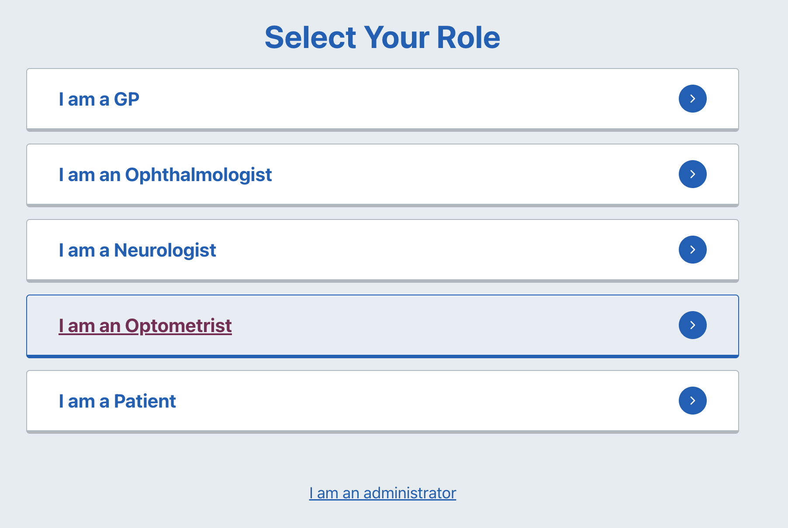
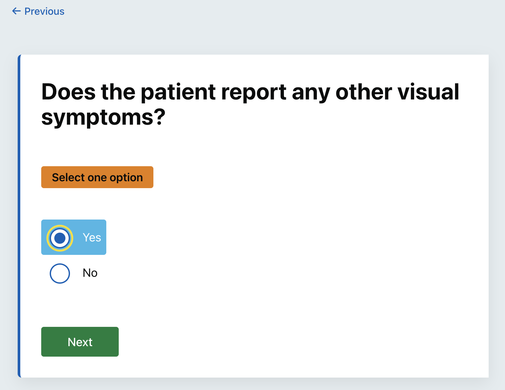
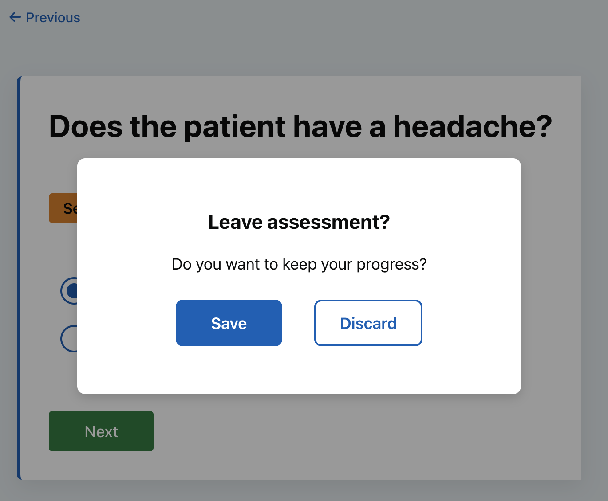
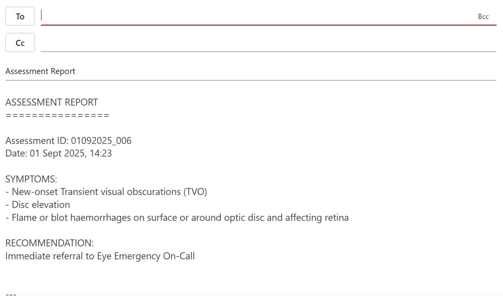
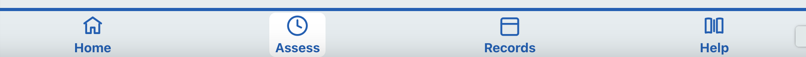
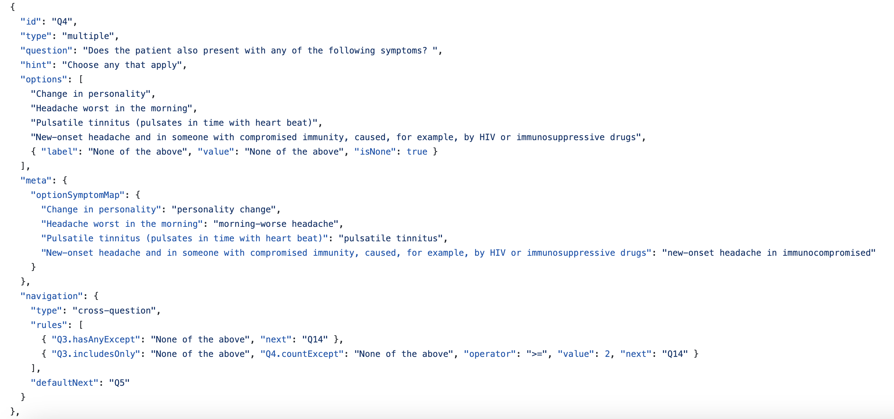

# Web-based Papilloedema Referral Platform - Technical Documentation

## How to Use This Documentation

For Clinicians and stakeholders, please read [Client Guide](#client-guide-for-nhs-clinicians). 
For engineers please read Engineering Handover (to be drafted).

Please click the following link to enter the software：https://dipp-frontend.onrender.com

If you have any specific questions, please check Table of Contents below:

### Table of Contents 
[Client Guide (for NHS Clinicians)](#client-guide-for-nhs-clinicians) 
   - [A1: System Instruction](#a1--system-instruction)
   - [A2: How to Read the Questionnaire JSON](#a2-how-to-read-the-questionnaire-json)
   - [A3: Standard Change Process (via GitHub)](#a3-standard-change-process-via-github)
   - [A4: FAQs](#a4-faqs)

---

## Client Guide (for NHS clinicians)

### A1 : System Instruction

**Logins and User Selection**

This system categorises roles into two types. Standard users encompassing *GPs, Ophthalmologists, Neurologists, Optometrists, and Patients*. 
**The Optometrist interface currently offers full functionality, while other roles remain under development.**
Administrator users must log in to the administrative interface using a password to view global data.

Users may select their role identity via the role selection page which is shown below:

    
    
Figure 1: Role-Selection Page

#### Assessment Workflow

You may start the assessment via the Assessment interface. During the assessment process, navigate between questions using the previous and next buttons, or alternatively, utilise your browser's back button.

    
    
Figure 2: Question Example

However, please refrain from refreshing the page during the assessment process, as this carries the risk of losing your progress.

When you try to leave the assessment page, a pop-up window will automatically appear asking if you want to save your current assessment progress. 

    
    
Figure 3: Pop-up Window

Please choose according to your needs. If you choose to save, the system will automatically return you to the last question you were on when you navigate back to the assessment page.

To view or export a report, please go to the Report page after completing the questionnaire. For each assessment you have completed, you can click the View Details button on the details page to perform more operations, including:
- `Copy` the report results to the clipboard
- `Download` a preview of the report (in PDF format)
- Send `Email`: This will open your default email client. The subject line will be automatically filled with *Assessment Report,* the body will be automatically populated with the assessment report content, and you can enter the recipient yourself.

    
    
Figure 4: Email Sending Function

#### Other Main Pages

You can navigate between the *Home, Assess, Records,* and *Help* pages using the navigation bar at the bottom of the page.

    
    
Figure 5: Bottom Navigation Bar

**Records** 
- Displays all assessment data the user has handled. 
- Users can use the filter box to narrow down the results. 

**Help：**  It includes a system user guide and a reference image gallery.
- **Reference Image Gallery:**  Provides visual references and diagnostic imaging examples for assessments. Users can use the filter box to find specific reference images.
- **App Tutorial for Optometrists:** A text-based guide on how to use all system functions.

For more detailed information (e.g. DIPP website and email), please check the Sidebar.

 
 

---

### A2: How to Read the Questionnaire JSON

JSON is a format for storing and transporting data, in this system, it's used to present referral logic. We understand that most users do not have a technical background, but having a basic understanding of the questionnaire's JSON structure will make it much easier for you to use and adjust the questionnaire. 
Since the questionnaire content is organized in natural language, no programming experience is needed to read and understand it. 
By familiarizing yourself with the following instructions, you will not only gain a clearer understanding of how the system works but also be able to make changes to the questionnaire flow yourself, 
reducing your reliance on technical staff.

Core JSON files is `questionnaire.json`.
This file describes the entire assessment flow in a simple JSON format, each question in the JSON contains a few key fields.
Table below illustrates what function each field maps to:

| Field | What it means                                                                                                                                                                                                                                                                         | Safe to edit?                                                                                                                                   |
|-------|---------------------------------------------------------------------------------------------------------------------------------------------------------------------------------------------------------------------------------------------------------------------------------------|-------------------------------------------------------------------------------------------------------------------------------------------------|
| **id** | A unique ID code for each question. The system uses it to know which question comes next.                                                                                                                                                                                             | **Do not change once published**                                                                                                                |
| **type** | The question format: `single` (choose one), `multiple` (choose several), `input` (free text), `confirm` (yes/no).                                                                                                                                                                     | Only change if you are sure about the effect on the workflow                                                                                    |
| **question** | The main text you see when filling in the questionnaire.                                                                                                                                                                                                                              | You can safely update the wording                                                                                                               |
| **hint** | Extra helper text shown under the question.                                                                                                                                                                                                                                           | You can safely update                                                                                                                           |
| **options** | The possible answers. Can be simple text (e.g. `"Yes"`) or an object like `{ "label": "None of the above", "value": "none", "isNone": true }`.  • `label` = what users see  • `value` = system code (used in logic & reports)  • `isNone` = marks “None of the above” option | You can edit the **label** text, or add new options.   Do **not** change or delete existing `id` or `value` fields without developer support |
| **meta.symptomOnYes** | Connects a “Yes” answer to an internal symptom keyword for reporting.                                                                                                                                                                                                                 | Needs clinical/technical review if changed                                                                                                      |
| **meta.optionSymptomMap** | Links each option (label/value) to an internal symptom keyword.                                                                                                                                                                                                                       | Edit with care, texts/values must match options                                                                                                 |
| **navigation.type** | Defines how the next question is chosen: `simple`, `conditional`, or `cross-question`.                                                                                                                                                                                                | Do not change unless advised by the dev team                                                                                                    |
| **navigation.rules** | The rules that decide which question comes next (e.g. `{ "Yes": "Q2", "No": "Q9" }`).                                                                                                                                                                                                 | Only change with developer/clinical guidance                                                                                                    |
| **navigation.defaultNext** | Fallback question id if no rule matches.                                                                                                                                                                                                                                              | Change only if you know the target exists                                                                                                       |

What it looks like in code example:

**We highly recommend that clinicians carefully check the "Safe to edit" column in the table before deciding whether to request technical support for modifications to the JSON file.**

 
 

---

### A3: Standard Change Process (via GitHub)

Follow these steps to safely update the questionnaire:
1. **Open the file**
    - Navigate to `docs/src/data/questionnaire.json`.

2. **Enter edit mode**
    - Click the pencil icon in the top-right corner of the file view to edit this file.

3. **Make safe edits only**
    - Change question text (`question`) or option labels (`options`), you may also add new options. **Do not change `id` values.**

4. **Increase the version number**
    - Locate the top-level field `"questionnaireVersion"`.
    - Increase it by **+1** (e.g. `12 → 13`). This helps track changes and allows rollback.

5. **Save your changes**
    - Scroll to the bottom of the page, in the `Commit changes` box, briefly describe what you changed.
    - Select `Create a new branch for this commit and start a pull request`.
    - Click `Propose changes`.

6. **Submit a Pull Request (PR)**
    - Pull Request is a feature in GitHub used by developers to propose and review changes to a project's code. Now, click `Create pull request` on the next page. (Your changes will now be reviewed. )
    - Then, wait for automated checks, the system will run automatic tests on your branch. A green ✔️ means the file passed validation. Before merging, please go through the following checklist:

| Check item | What to do |
|---|---|
| **All `goto` targets exist** | In every `navigation.rules`, make sure the `id` you point to is present in the file. |
| **Flow is continuous** | Starting from `Q1`, you should be able to reach an end state (e.g. `URGENT_TO_OPH`, `NO_REFERRAL`) without loops or dead ends. |
| **Required questions can be answered** | For every `"validation": { "required": true }`, check that options exist and can be selected. |
| **Edits tested locally if possible** | Walk through the JSON logic mentally or with a local/test environment if available. |
| **Version updated** | The top-level `"questionnaireVersion"` has been increased by **+1**. |
| **Change description added** | The PR commit message or description clearly explains the change. |

If all checks are satisfied, proceed to merge (Step 7).

7. **Confirm clinical logic and merge PR**
    - Review your edits in the PR and confirm they are correct.
    - Then, Merge the PR into the main branch (by **Admin or any authorized user**).

8. **Wait for automatic deployment**
    - After merging, deployment starts automatically.
    - Wait a few minutes, then open the usual deployment link [here](https://dipp-frontend.onrender.com) to walk through the questionnaire end-to-end to confirm your edits appear and work correctly.

9. **Rollback if needed**
    - If the new questionnaire does not behave as expected, notify the Admin.
    - They can roll back to the previous `questionnaireVersion`.

   

----

### A4: FAQs

**Q: I cannot log in / I forgot my password.** 
Please contact the Admin to access the password - And always remenber to check the network connection first.

**Q: The Records page shows “Loading...” for a long time.** 
When there are numerous records, it takes time to load the data.
In addition, for patient privacy protection, users can only view data they have personally handled.

**Q: How do I know my edits have taken effect?** 
The system is deployed automatically . After merging your change, please wait a few minutes and then refresh the application link. 

 
 
 
 
 

